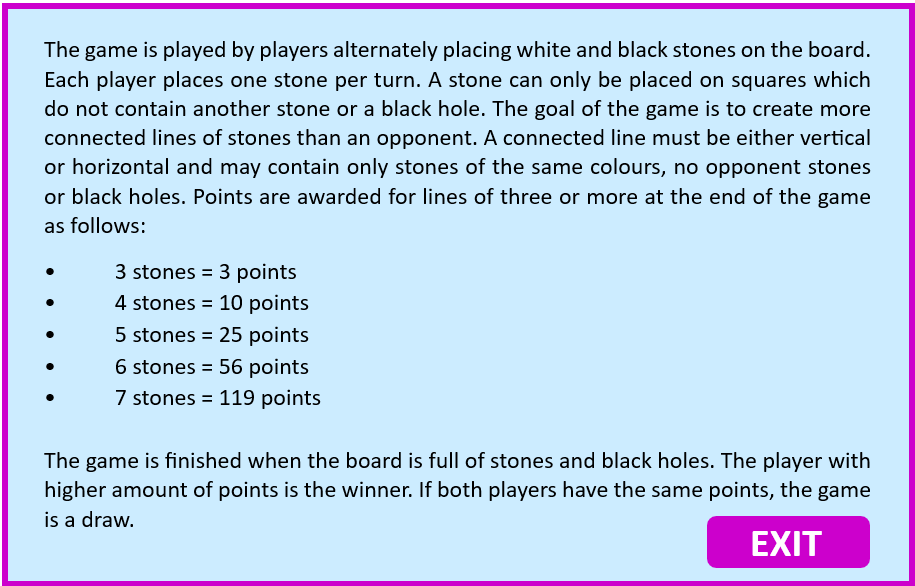

# Pahtum — Strategic Board Game 🎮♟️  
[](https://www.python.org/)  
[](https://www.pygame.org/news)  
[](LICENSE)  

An implementation of **Pahtum**, a strategic board game, developed in **Python** with **Pygame**.  
It supports multiple game modes and AI opponents powered by **Minimax with alpha-beta pruning** and **Monte Carlo Tree Search (MCTS)**.  

---

## ✨ Key Features

- 🎮 **Game Modes**
  - Player vs Player  
  - Player vs Computer → *Easy (Random)*, *Medium (Minimax)*, *Hard (MCTS)*  
  - Computer vs Computer → *Expert vs Average*, *Expert vs Beginner*, *Average vs Beginner*  

- 📋 **Rules & Scoring**
  - Random **black holes** on the board (blocked cells)  
  - Lines must be **horizontal or vertical** and contain only stones of the same color  
  - Scoring at the end of the game:  
    - 3 in a row → 3 points  
    - 4 in a row → 10 points  
    - 5 in a row → 25 points  
    - 6 in a row → 56 points  
    - 7 in a row → 119 points  

- 🧠 **AI Opponents**
  - Minimax with alpha-beta pruning  
  - Monte Carlo Tree Search (MCTS) with UCB1  
  - Heuristic evaluation: center control, blocking bonus, dynamic scoring  

- 🎨 **Interface**
  - Graphical menu and in-game UI built with Pygame  
  - Help screen and background music for immersion  

---

## 🛠️ Tech Stack

- **Language:** Python 3.10+  
- **Library:** Pygame  
- **Algorithms:** Minimax, Alpha-Beta Pruning, Monte Carlo Tree Search  

---

## 🗂️ Repository Structure

```
Pahtum-Game/
├─ src/
│  ├─ interface_principal_user_vs_user.py
│  ├─ interface2_user_vs_computer.py
│  └─ interface3_computer_vs_computer.py
├─ assets/
│  ├─ images/  (tela1.jpg, tela2.jpg, tela3.jpg, tela_ajuda.png)
│  ├─ audio/   (music.mp3)
│  └─ fonts/   (fonte.ttf)
├─ docs/
│  ├─ Project-Presentation.pdf
│  └─ read_me-Pathum.pdf
├─ requirements.txt
├─ .gitignore
├─ LICENSE
└─ README.md
```

---

## 🚀 Installation & Execution

### Requirements
- Python 3.10+  
- Pygame (install via `requirements.txt`)  

### Steps

```bash
# 1) Clone the repository
git clone https://github.com/<your-username>/Pahtum-Game.git
cd Pahtum-Game

# 2) Create and activate virtual environment
python3 -m venv .venv
source .venv/bin/activate      # macOS/Linux
# .venv\Scripts\activate       # Windows

# 3) Install dependencies
pip install -r requirements.txt

# 4) Run one of the game modes
python src/interface_principal_user_vs_user.py
python src/interface2_user_vs_computer.py
python src/interface3_computer_vs_computer.py
```

💡 On macOS, if audio initialization fails, the game still runs (audio loading is handled safely).  

---

## 🖼️ Demo

Main Menu             |  Help Screen  
:--------------------:|:------------------:  
 |   

---

## ♟️ How to Play

1. Select a game mode in the main menu.  
2. Players alternately place one stone per turn.  
3. Stones cannot be placed on occupied squares or black holes.  
4. The game ends when the board is full.  
5. The player with the **highest score** wins.  
   A tie occurs if both players achieve the same score.  

---

## 🔧 Configurable Parameters

- `BOARD_SIZE` → board dimensions  
- `NUM_BLACK_HOLES` → number of blocked cells  
- `DEPTH_MINIMAX` / `ITERATIONS_MCTS` → AI difficulty levels  

---

## 📈 Roadmap / Future Work

- Merge all interfaces into a **single unified menu**  
- Add automated tests for rules and scoring  
- Implement **adaptive depth/iterations** for smarter AI  
- Add internationalization (EN/PT)  

---

## 👩‍💻 Authors

- Catarina Abrantes  
- **Liliana Silva**  
- Mariana Fonseca  

---

## 📜 License

Distributed under the [MIT License](LICENSE).  
